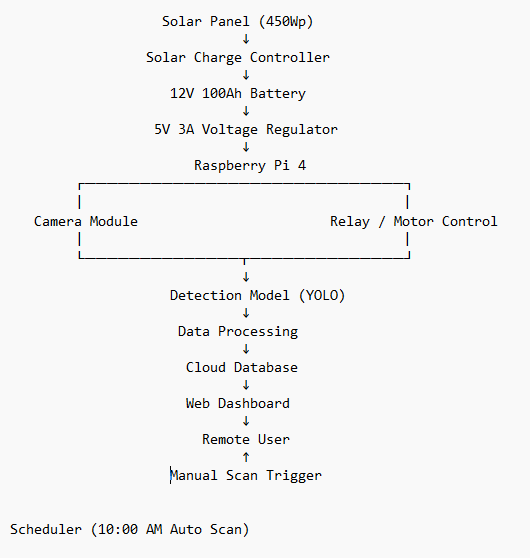

# Smart Harvest

### Solar-Powered Edge Computer Vision System for Automated Fruit Ripeness Monitoring

Smart Harvest is an embedded edge-AI system developed to support automated fruit ripeness monitoring in agricultural environments. The system integrates renewable energy, embedded computing, computer vision, and cloud-based monitoring to enable autonomous field operation.

The platform performs scheduled image acquisition and ripeness detection using a YOLO-based model deployed on a Raspberry Pi. Detection results are transmitted to a cloud database and visualized through a web-based monitoring dashboard, allowing remote observation and manual system triggering.

---

## System Architecture

The system consists of three main subsystems:

**Power System**

* 450 Wp solar panel
* Solar charge controller
* 12V 100Ah battery
* 5V 3A voltage regulator

**Edge Processing**

* Raspberry Pi 4 as the main controller
* Camera module for image acquisition
* YOLO-based ripeness detection model
* Custom relay PCB for motor control
* Automated daily scanning scheduler (10:00 AM)

**Cloud Monitoring**

* Cloud database for data storage
* Web-based IoT dashboard
* Remote user monitoring and manual scan triggering

---

## Key Capabilities

* Solar-powered autonomous operation
* Edge AI deployment for on-device fruit detection
* Integrated mechanical scanning mechanism
* Remote monitoring and control through web interface
* Full hardware–software system integration

---

## Demonstration

Live system interface:
https://smartharvest.online
.jpg)
---

## Repository Structure

* docs/ – system documentation and architecture diagram
* hardware/ – electrical design, PCB files, and wiring
* software/ – detection model, system control scripts, and dashboard code

---

## Technologies

Python • Raspberry Pi • YOLO • PCB Design • Solar Energy System • Web Dashboard • Cloud Database

---

## Future Research Direction

This project represents an initial step toward developing autonomous, solar-powered agricultural support systems.

Future work includes the development of a solar-powered automated organic waste composting system designed to convert agricultural waste into sustainable fertilizer through controlled mechanical processing and embedded control logic.

The focus will be on low-energy operation, system reliability, and sustainable off-grid deployment.

**Author**

Muhammad Rafli Abdillah
Undergraduate Student – Electrical Engineering
Research Interests: Embedded Systems, Computer Vision, Precision Agriculture
